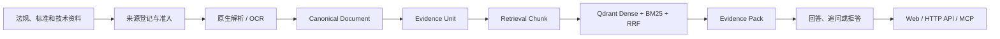

# 架构说明

环保法规规范证据助手采用分层结构，把资料治理、证据检索和答案生成分开。系统的事实依据是可回查的证据单元，而不是模型生成文本。

## 核心分层

| 层 | 目录 | 职责 |
| --- | --- | --- |
| 领域模型 | `src/domain/` | 文档、证据、查询状态和不可变业务规则 |
| 应用服务 | `src/application/` | 资料生命周期、范围解析、检索、回答与可观测性编排 |
| 基础设施适配 | `src/adapters/` | SQLite、Qdrant、模型供应商、清单和 trace 实现 |
| 文档处理 | `src/ingestion/` | PDF 原生解析、OCR 路由、坐标与表格保留 |
| 检索 | `src/retrieval/` | 中文向量、数值区间、索引与语料版本发布 |
| 接口 | `src/server/`、`src/mcp_adapter/` | 网页、HTTP API 和只读 MCP |

## 资料与语料状态

系统分别维护三类状态，避免把“文件存在”误认为“可以正式回答”：

1. 文档准入：来源、版本、效力和使用边界是否经过核验。
2. 处理状态：页面解析质量是否通过，或需要 OCR、人工复核和隔离。
3. 语料发布：哪些证据单元进入当前正式检索版本。

这三类状态相互独立。新增环保领域资料时沿用相同的登记、处理、评估和发布机制。

## 证据约束

- `EvidenceUnit` 保存原文、文档版本、条款路径、物理页码和定位信息。
- `RetrievalChunk` 可以增加标题、表头和父级语境以改善召回，但不能替代可引用原文。
- 检索结果先组成 `EvidencePack`，答案中的每个 claim 必须引用允许使用的 Evidence ID。
- 条件不完整时返回追问；证据不足时拒答；仅允许定位的资料不会生成结论。

## 检索与接口

Qdrant 同时保存 dense 与中文词法表示，并通过 RRF 合并结果。数值区间查询会保留时间尺度、单位和边界条件。相同的查询应用服务被网页、HTTP API 和 MCP 复用，避免不同入口产生不同业务规则。

## 运行数据

- `data/raw/`：仓库携带的原始资料。
- `data/registry/`：文件清单、来源状态和版本 manifest。
- `data/evidence/`：运行所需的可引用证据单元。
- `data/retrieval/`：运行所需的检索块。
- SQLite、Qdrant 存储、日志、模型缓存和可重建的解析中间产物不进入 Git。
