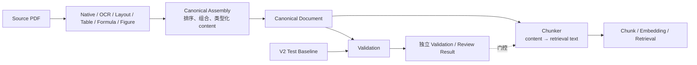

# V2 PDF Pipeline Canonical Document Schema Design

## 文档控制

- 状态：Confirmed
- 确认日期：2026-09-21（初稿 2026-09-19）
- Schema：`v2.canonical/1.0`
- 输入基线：`data/review/v2/pdf_pipeline_cases.jsonl`、`data/review/v2/coverage_matrix.md`
- 定位：PDF Parsing 的唯一正式输出；Validation 和 Chunking 的唯一内容上游
- 本轮只设计 Schema，不实现 parser、chunker 或 embedding，不运行解析

## 1. 定位与边界

Canonical Document 负责表达：

> PDF 中有什么内容、文档有哪些可过滤的业务元数据、内容是什么类型、来自哪里、如何提取。

它不是 parser 调试日志，不是 QA/Review 报告，也不提前生成检索文本。

```text
PDF → native/OCR/layout/table/formula/figure processors
                         ↓
                Canonical Document
                 ├─ Validation / Review
                 └─ Chunker
                      ↓
             类型化文本投影 / 组合 / 切分
                      ↓
               Chunk → Embedding
```

Canonical 输出一条按全文逻辑顺序排列的 `elements[]`。每个 Element 使用同一个 envelope，不同内容类型只在强类型 `content` 中保存不同原数据。

```text
CanonicalDocument
├── source
├── metadata             # 强类型文档元数据与状态快照
├── generation
├── pages[]              # 物理页目录
└── elements[]           # 全文逻辑顺序，Chunker 的唯一内容输入
    └── Element
        ├── element_id
        ├── type
        ├── role
        ├── label
        ├── section_path
        ├── content      # discriminated union
        ├── source_spans
        ├── provenance
        └── links
```

Chunker 读取 `Element.content`，根据 `type` 生成可检索文本，再按 Element 边界、章节结构和 token budget 生成 Chunk。Chunker 不重新解析 PDF，也不修复表格、公式或阅读顺序。

## 2. V2 Test Baseline 带来的设计压力

Baseline 现有 46 个 case，来自 9 份 PDF：29 个 `human_gold`、13 个 `human_review`、4 个 `automated_only`，其中 8 个 regression。

| 真实场景 | Schema 要求 |
| --- | --- |
| native / OCR / hybrid OCR | 最终都是 TextElement；提取差异进入 provenance |
| 标题、条款、正文、密集文本 | Element 有 role、label、section_path |
| 页眉页脚、水印、页码 | 保留为 TextElement，用 role 供 Chunker 过滤 |
| 合并单元格 | TableContent 保存 rows/columns、cells、rowspan/colspan |
| 旋转表格 | SourceSpan 保存 bbox 与区域方向 |
| 续表 / 跨页表格 | 一个逻辑 TableElement 可有多页 spans；不确定时保留 fragments 和 link |
| 公式 | FormulaContent 保存编号、识别结果和明确关联的原文上下文 |
| 跨页公式说明 | 一个 FormulaElement 可覆盖多页 context spans |
| 图片和图注 | FigureContent 保存 crop、像素尺寸、原文 caption/reference |
| 空白页 | Page 明确标 blank，不产生伪 Element |
| 阅读顺序 / 复杂混排 | `elements[]` 数组顺序是唯一逻辑顺序 |
| multi-column | 当前无 Gold；V1 能保存线性顺序和 bbox，不预建列树 |

## 3. 关键决策

### 3.1 Element 外壳统一，content 按 type 不同

| `type` | `content` Schema | 保存内容 |
| --- | --- | --- |
| `text` | `TextContent` | 原文文本，可选列表信息 |
| `table` | `TableContent` | 行列规模、cells、spans、caption、notes |
| `formula` | `FormulaContent` | formula number、LaTeX/识别文本、原文 context |
| `figure` | `FigureContent` | crop asset、像素尺寸、原文 caption/reference |

`content` 不是任意 metadata bag。它是以 `type` 为判别字段的 union：`type=table` 时必须满足 TableContent，未知字段默认拒绝。

### 3.2 elements 是逻辑主结构，pages 是来源目录

不采用 `pages[].contents[]` 作为主内容。页面嵌套会把跨页段落、续表、公式说明和图注组合工作推给 Chunker。

`elements[]` 按全文逻辑顺序排列。一个逻辑 Element 可以有多个跨页 SourceSpan。Page 只提供物理页尺寸、旋转、印刷页码以及 blank/failed 区分。

### 3.3 Canonical 不保存公共 text

Element 不存在统一 `text` 字段。Canonical 不预先决定：

- 表格如何线性化；
- 公式和上下文如何拼成检索字符串；
- 图片 caption/reference 如何进入 embedding；
- 文档标题和 section path 是否作为 chunk prefix；
- embedding normalization 如何处理字符。

这些属于 Chunker 的版本化 projection 规则。因此 `text_projection_version` 不属于 Canonical generation，而应记录在 Chunk/Chunker 配置与产物身份中。

### 3.4 Metadata 必须存在，但必须强类型

Canonical 顶层必须有 `metadata`。它保存文档自身的业务事实与状态快照，后续由 Chunk 继承并物化为 Qdrant payload/filter fields。

当前 registry 已有 standard number、document kind、jurisdiction、source authority、publication/effective date 和 effective status，证明这些不是预想字段。

`metadata` 与以下内容不同：

- 不是任意键值 `metadata: {anything: ...}`；
- 不是 parser raw dump；
- 不是 Human Review、source review 或发布审批；
- 不是 Chunker 生成的检索摘要。

Document-level metadata 负责标准号、类型、地域、发布机关、日期和效力状态。Element-level 的 `type / role / label / section_path / source_spans` 本身就是结构化 metadata，不再增加第二个任意 Element metadata bag。

### 3.5 QA / Review 完全外置

以下字段禁止进入 Canonical：

- `truth_level`、`human_assertions`、`known_issue`、`regression_reason`；
- `review_status`、`quality_status`、`publishable`、`quarantine`；
- 自动 review pass/fail；
- M2/M3 ID、旧 canonical/evidence ID、runtime artifact path。

Validation/Review 通过 `canonical_id + element_id` 或 `canonical_id + physical_page` 外部关联。修正 parsing 内容产生新的 Canonical artifact，不回写旧 artifact。

## 4. 顶层 Schema

```json
{
  "schema_version": "v2.canonical/1.0",
  "canonical_id": "canonical-sha256:<canonical-content-and-metadata-sha256>",
  "canonical_content_id": "canonical-content-sha256:<content-only-sha256>",
  "metadata_fingerprint": "metadata-sha256:<metadata-serialization-sha256>",
  "document_id": "pdf-sha256:<source-pdf-sha256>",
  "source": {
    "sha256": "<64 lowercase hex>",
    "file_name": "example.pdf",
    "media_type": "application/pdf",
    "page_count": 68,
    "source_uri": null
  },
  "metadata": {
    "title": "<document title or file-name fallback>",
    "alternate_titles": [],
    "language": "zh-CN",
    "identifiers": [
      {"scheme": "standard_number", "value": "DB4201/T 651-2021"}
    ],
    "document_kind": "standard",
    "jurisdictions": ["武汉市"],
    "issuing_authorities": [],
    "publication_date": null,
    "effective_from": null,
    "effective_to": null,
    "effective_status": "unknown",
    "effective_status_as_of": "2026-09-19",
    "registry_snapshot_id": "source-registry-sha256:<snapshot-sha256>"
  },
  "generation": {
    "run_id": "<opaque id>",
    "created_at": "2026-09-19T00:00:00Z",
    "pipeline": "v2-pdf-pipeline",
    "pipeline_version": "<version>",
    "config_sha256": "<64 lowercase hex>",
    "engines": [
      {"engine_id": "native-1", "name": "pymupdf", "version": "<version>"},
      {"engine_id": "ocr-1", "name": "paddleocr", "version": "<version>"}
    ]
  },
  "pages": [],
  "elements": []
}
```

| 字段 | 必需 | 含义 |
| --- | --- | --- |
| `schema_version` | 是 | 固定 `v2.canonical/1.0` |
| `canonical_id` | 是 | 审计身份：`schema_version + document_id + source + metadata + pages + elements` 规范序列化后的 SHA-256；metadata 变更即变 |
| `canonical_content_id` | 是 | 内容缓存键：`schema_version + document_id + source + pages + elements` 规范序列化后的 SHA-256，不含 metadata；内容不变则不变 |
| `metadata_fingerprint` | 是 | `metadata` 规范序列化后的 SHA-256；仅反映 metadata 变化，与 content 变化解耦 |
| `document_id` | 是 | 只由 source PDF SHA 决定 |
| `source` | 是 | 原 PDF 身份；SHA 是身份，文件名/URI 只作显示 |
| `metadata` | 是 | 强类型文档事实与状态快照，供 Chunk/Qdrant 继承和过滤 |
| `generation` | 是 | 解析可复现信息和 engine registry，不含 QA 或 Chunk 投影配置 |
| `pages` | 是 | 完整物理页目录 |
| `elements` | 是 | 全文有序逻辑内容 |

两个 ID 的 digest 输入：

- `canonical_id`（审计身份）= `schema_version + document_id + source + metadata + pages + elements` 规范序列化的 SHA-256。run ID 和 created time 不参与。
- `canonical_content_id`（缓存键）= `schema_version + document_id + source + pages + elements` 规范序列化的 SHA-256，**不含 metadata**。
- `metadata_fingerprint` = `metadata` 单独规范序列化的 SHA-256，与 content 变化解耦。

二者分离的目的：metadata 值或效力状态快照改变会得到新的 `canonical_id` 与新的 `metadata_fingerprint`，但 `canonical_content_id` 不变；因此不要求重新解析 PDF，也不要求重算 embedding 向量，可以从同一 `pages + elements` 生成新的 Canonical snapshot。`canonical_content_id` 是 Chunk/Qdrant 判断内容是否需要重算的唯一依据。

### 4.1 DocumentMetadata

| 字段 | 必需 | 规则与过滤用途 |
| --- | --- | --- |
| `title` | 是 | 正式标题；无法可靠提取时使用 file name fallback |
| `alternate_titles` | 是 | 已登记的别名；数组可空 |
| `language` | 是 | BCP 47，如 `zh-CN` |
| `identifiers` | 是 | `{scheme,value}` 数组；标准号使用 `standard_number` scheme |
| `document_kind` | 是 | `standard | regulation | policy | guideline | notice | report | other | unknown` |
| `jurisdictions` | 是 | 适用地域数组；未知时为空，不用“全国”代替未知 |
| `issuing_authorities` | 是 | 发布/批准机关数组；未知时为空 |
| `publication_date` | 否 | ISO `YYYY-MM-DD` |
| `effective_from` | 否 | ISO `YYYY-MM-DD` |
| `effective_to` | 否 | ISO `YYYY-MM-DD`；仍有效或未知时为空 |
| `effective_status` | 是 | `current | not_yet_effective | expired | repealed | superseded | unknown` |
| `effective_status_as_of` | 条件必需 | status 非 unknown 时必须存在，说明状态快照日期 |
| `registry_snapshot_id` | 是 | 指向生成这些选定值的不可变 source registry snapshot |

字段规则：

- Metadata 值可以来自 PDF 原文、文件登记或 source registry，但进入 Canonical 前必须归一为上述类型；
- 未知值使用 null、空数组或 `unknown`，不得用猜测值填充；
- 更详细的逐字段 observation、证据、冲突和审核过程保留在 source registry，通过 `registry_snapshot_id` 追溯，不复制进 Canonical；
- `source_review`、`local_file_match`、`selection_status`、review note 属于治理/发布状态，不进入 DocumentMetadata；
- `effective_status` 是问答范围和检索过滤所需的业务状态，因此允许作为带日期的快照进入 Canonical；
- 不设置自由扩展的 `tags` 或任意键值；新增正式过滤维度需要升级 Schema。

### 4.2 Metadata 到 Chunk/Qdrant 的继承

Chunk 构建必须从 Canonical metadata 复制需要过滤的字段，而不是重新读取 CSV 或猜测：

```text
Canonical.metadata
  ├── identifiers.standard_number
  ├── document_kind
  ├── jurisdictions
  ├── issuing_authorities
  ├── publication/effective dates
  └── effective_status + as_of
          ↓
Chunk metadata
          ↓
Qdrant payload filters
```

Element-level filter fields来自 Element envelope：

- `type`、`role`、`label`；
- `section_path`；
- 从 `source_spans` 汇总的 physical pages；
- source PDF SHA、document ID、canonical ID。

这样 Metadata 是 Canonical 的真实组成部分，但检索系统仍可将其扁平化为适合数据库过滤的 payload。

### 4.3 双 ID 下游复用规则

`canonical_id` 与 `canonical_content_id` 分工，避免 metadata 变更引发下游全量重算：

```text
metadata 变更（效力状态/标准号/地域/机关/日期等）
  → canonical_id 变、canonical_content_id 不变
  → Chunk 缓存键不变 → 不重切、不重投影、不重算向量
  → 只更新 Qdrant payload 的 metadata 字段
  → canonical_id 仍随 Chunk provenance 记录，保证审计可回到该 snapshot
```

复用规则：

- **Chunk 缓存键**用 `canonical_content_id`（而非 `canonical_id`）。内容不变的 Chunk 直接复用，projection_version 仍参与 Chunk artifact identity。
- **Qdrant**在 `canonical_content_id` 不变时不重算 vector，仅按新 `metadata_fingerprint` 更新已有点的 payload metadata 字段；`canonical_id` 与 `metadata_fingerprint` 一并写回 payload 供审计与状态过滤。
- **Chunk provenance**同时记录 `canonical_id`（审计 snapshot 身份）与 `canonical_content_id`（缓存/复用键），二者区分见 9.3。
- **内容变更**（`pages` 或 `elements` 变化）才会使 `canonical_content_id` 变化，此时必须重新切分、重投影、重算向量。
- `document_id` 不受 metadata 或 content 变更影响，始终指向同一 source PDF。

## 5. Page

```json
{
  "physical_page": 24,
  "printed_label": "15",
  "width": 396.851,
  "height": 595.275,
  "unit": "pt",
  "rotation_degrees": 0,
  "parse_status": "parsed",
  "parse_error": null
}
```

| 字段 | 规则 |
| --- | --- |
| `physical_page` | 1-based，严格连续 1..page_count |
| `printed_label` | 可空；不能替代 physical page |
| `width` / `height` | 旋转归一化后的页面尺寸，正数 |
| `unit` | V1 固定 `pt` |
| `rotation_degrees` | 0/90/180/270 |
| `parse_status` | `parsed | blank | failed`；执行事实，不是 QA |
| `parse_error` | 仅 failed 时为 `{code,message}`，不得含堆栈或敏感数据 |

Blank/failed 页不贡献正式 Element spans。Parsed 页应至少被某个 Element span 覆盖；一个跨页 Element 可以覆盖多个 Parsed 页。

## 6. Element Envelope

```json
{
  "element_id": "e000123",
  "type": "table",
  "role": "table",
  "label": "表3.2.3",
  "section_path": [
    {"label": "3", "title": "项目评价"},
    {"label": "3.2", "title": "地块项目评价"}
  ],
  "content": {},
  "source_spans": [],
  "provenance": [],
  "links": []
}
```

| 字段 | 必需 | 说明 |
| --- | --- | --- |
| `element_id` | 是 | Canonical 内唯一；下游与 canonical ID 组合使用 |
| `type` | 是 | `text | table | formula | figure`，决定 content Schema |
| `role` | 条件必需 | TextElement 必需；其他类型 V1 使用固定 role，可省略或按 Schema 固定 |
| `label` | 否 | 源文档显式编号，如 2.1、表3.2.3、5.4.2-2、图3 |
| `section_path` | 是 | 从外到内的逻辑路径；可为空 |
| `content` | 是 | 由 type 决定的强类型内容 |
| `source_spans` | 是 | 至少一个 primary span；允许跨页 |
| `provenance` | 是 | 有序解析来源，不是质量判断 |
| `links` | 是 | 可为空；连续、引用或明确关联 |

`elements[]` 的数组顺序是唯一权威阅读顺序，不另存 `reading_order`。跨页 Element 放在第一个 primary span 对应的逻辑位置。

`section_path`：

```json
[
  {"label": "7", "title": "调查成果评估"},
  {"label": "7.1", "title": "一般规定"}
]
```

路径只保留可靠识别到的层级；不确定时截短，不猜测。

## 7. SourceSpan、Provenance、Link

### 7.1 SourceSpan

```json
{
  "span_id": "s000456",
  "role": "primary",
  "physical_page": 24,
  "bbox": [107.405, 65.946, 287.415, 91.283],
  "orientation_degrees": 0
}
```

`role`：

- `primary`：Element 主体；至少一个；
- `continuation`：主体的跨页延续；
- `caption`：表题/图题；
- `context`：公式说明、单位说明、明确图文引用；
- `note`：脚注或表注。

坐标为 `[x0,y0,x1,y1]`，单位 page points；使用旋转归一化页面、左上原点、x 向右、y 向下。bbox 必须在 Page 边界内。`orientation_degrees` 表示页内区域方向。V1 只支持轴对齐矩形；当前 baseline 不足以要求 polygon。

### 7.2 Provenance

```json
{
  "operation": "recognize",
  "method": "table_recognition",
  "engine_id": "table-1",
  "confidence": 0.94
}
```

| 字段 | 约束 |
| --- | --- |
| `operation` | `detect | extract | recognize | classify | merge | crop` |
| `method` | `native_text | ocr | hybrid | layout_detection | table_recognition | formula_recognition | image_extraction` |
| `engine_id` | 引用 generation engine registry |
| `confidence` | 可空，0..1；engine-local，不能当 QA pass |

Hybrid 页不使用 page-level route。每个 Element 记录实际经过的 native/OCR/merge 等步骤。

### 7.3 Link

```json
{"type": "references", "target_element_id": "e000130"}
```

V1 类型：

- `continues`：未合并、但有明确连续关系的 fragments；
- `references`：正文/公式显式引用图、表或公式；
- `related`：有明确原文关系但不属于前两类。

仅靠页码相邻或几何接近不能创建语义 link。

## 8. Discriminated `content` Union

### 8.1 TextContent

`type=text`：

```json
{
  "text": "降雨的发生、发展和结束的全部演变过程。",
  "list": null
}
```

规则：

- `text` 是从 PDF 得到的原文转写，非空；
- Unicode NFC，换行统一为 `\n`；
- 不同时保存 competing `normalized_text`；
- `list` 仅列表项使用 `{marker, level}`，否则 null。

Text role：

`document_title | heading | clause | paragraph | list_item | header | footer | page_number | watermark | unknown`

### 8.2 TableContent

```json
{
  "row_count": 8,
  "column_count": 5,
  "caption": "表3.2.3 地块项目评价指标",
  "cells": [
    {
      "row": 0,
      "column": 0,
      "row_span": 2,
      "column_span": 1,
      "role": "header",
      "text": "评价对象",
      "source_span_ids": ["s010001"]
    }
  ],
  "notes": []
}
```

规则：

- `row_count`、`column_count` 是逻辑 grid 规模，不是像素宽高；
- 表格在 PDF 上的物理宽高由 primary span bbox 推导，不重复保存；
- `caption` 是原文表题，可空；
- cells 使用 0-based row/column，row/column span >= 1，占用区不得重叠；
- cell role：`header | stub | data | unknown`；
- cell `text` 是原文转写，可为空字符串表示视觉空 cell；
- `source_span_ids` 可为空；为空时只能回查到 table-level bbox；
- `notes` 为 `{text, source_span_ids}`，只保存原文表注、单位说明；
- 不保存 HTML、Markdown 或预先线性化的表格文本。

跨页表格允许两种形式：

1. 已确认同一逻辑表：一个 TableElement，多页 spans，一组统一 cells；
2. 尚不能可靠合并：多个相邻 TableElement，各自保留本页 cells，以 `continues` link 连接。

### 8.3 FormulaContent

Minimal V1：

```json
{
  "formula_number": "5.4.2-2",
  "latex": "Q=\\frac{1}{n}\\sum_{i=1}^{n}A\\times L_i/\\Delta t_i\\times k\\times3600\\times24",
  "recognized_formula": null,
  "context_text": "式中：Q——流量（m³/d）；n——测定次数（次/d），每日测量6次～8次，对应的时间间隔为3h～4h；A——管渠过流面积（m²）；L_i——第i次测定浮标流动的起止点距离（m）；Δt_i——第i次测定所用的时间（s）；k——浮标法测定的表面流速与断面平均流速之间的修正系数，取0.8～0.9。"
}
```

规则：

- `formula_number` 保存源文档显式编号，可空；通常与 Element `label` 相同，但 FormulaContent 自足保留；
- `latex` 保存结构化公式识别结果；没有可靠 LaTeX 时为 null；
- `recognized_formula` 保存非 LaTeX 的字面识别结果；只在 `latex` 不可用或需要保留识别原貌时使用；
- `context_text` 是与公式明确相关的原文，按阅读顺序连接“式中……”、取值范围和局部条件；可跨页；
- 公式本体使用 `role=primary` 的 spans，说明文字使用 `role=context` 的 spans。context spans 的数组顺序对应 `context_text` 的来源顺序；
- V1 不主动拆解 variables、symbol definition、unit、conditions；
- 只有未来出现确定性的原文结构提取和充分测试证据，才在新 Schema 版本考虑增加变量级结构；
- 数学等价、可执行表达式、正负号选择结论不属于 Canonical V1。

机器转写用于检索和辅助回答，原 PDF 页码与 bbox 始终是最终核验来源。

### 8.4 FigureContent

```json
{
  "caption": "图3 圆形管渠横断面示意图",
  "references": [
    {
      "text": "l——AB的弧长（m）（图3）",
      "source_span_ids": ["s030004"]
    }
  ],
  "asset": {
    "ref": "assets/sha256/<crop-sha256>.png",
    "sha256": "<64 lowercase hex>",
    "media_type": "image/png",
    "pixel_width": 1276,
    "pixel_height": 424
  }
}
```

规则：

- asset 是原 PDF 区域的 crop，不是生成图片；
- `asset.ref` 是 Canonical package 内内容寻址的相对路径；
- `pixel_width` / `pixel_height` 是 crop 像素尺寸；PDF 物理尺寸由 bbox 推导；
- caption/reference 只能来自原文，并以 source span 定位；
- baseline 没有自动图片描述 Gold，V1 不含 `generated_description`；
- 没有 caption/reference 的图片仍可保存 asset，但 text-only Chunker 不得编造检索文本。

## 9. Chunker Contract

Chunker 的输入是按逻辑顺序排列的 `elements[]`，但它不切 JSON 字符串。处理过程：

```text
Element.content
  ↓
按 type 使用版本化、确定性的文本投影
  ↓
按 Element 边界与 section_path 组合
  ↓
按 token budget 切分
  ↓
Chunk
```

### 9.1 类型化投影

| Element type | Chunker 文本来源 |
| --- | --- |
| `text` | `content.text` |
| `table` | caption + cells，按确定规则展开 merged header/context |
| `formula` | formula number + latex 或 recognized_formula + context_text |
| `figure` | caption + 原文 references；无原文文字时不生成 text embedding 输入 |

示例投影不是 Canonical 字段：

```text
Table:
[表3.2.3] 地块项目评价指标
评价对象 | 一级指标 | 二级指标 | 分值 | 总分
地块项目 | 评分项-I基础工作 | 管网竣工数据资料 | 10分 | 100分

Formula:
[公式 5.4.2-2] Q=\frac{1}{n}\sum_{i=1}^{n}A\times L_i/\Delta t_i\times k\times3600\times24
式中：Q——流量（m³/d）……k——修正系数，取0.8～0.9。

Figure:
[图3] 圆形管渠横断面示意图
原文引用：l——AB的弧长（m）（图3）。
```

Chunker projection 规则及其版本属于 Chunk 构建配置，并参与 Chunk artifact/cache identity。它不属于 Canonical generation。

### 9.2 Chunker 可以做

- 顺序遍历 `elements[]`；
- 按 type 将 `content` 投影成可检索文本；
- 使用 metadata.title 和 section_path 生成 chunk context；
- 将 Canonical metadata 和 Element-level filter fields 继承到 Chunk metadata；
- 依据 role 排除 header/footer/page_number/watermark；
- 长正文按句段切分，大表按逻辑行切分，公式通常作为原子单元；
- 按 token budget 合并相邻 Element 并设置 overlap；
- 复制 canonical ID、element IDs 和 source spans 到 Chunk；
- text embedding 使用投影文本；未来 multimodal embedding 可读取 FigureContent.asset。

### 9.3 Chunker 不得做

- 重新读取或解析 PDF；
- native/OCR 结果择优；
- 从 HTML 恢复 table cells 或修复 merged cells；
- 搜索公式说明、跨页拼接公式上下文或修正公式；
- crop 图片、关联图注或生成图片描述；
- 恢复阅读顺序、猜 section hierarchy；
- 从旧 M2/M3/unified artifacts 补内容。

最小 Chunk provenance：

```json
{
  "canonical_id": "canonical-sha256:...",
  "canonical_content_id": "canonical-content-sha256:...",
  "element_ids": ["e000123", "e000124"],
  "source_spans": [
    {"physical_page": 24, "bbox": [107.405, 65.946, 287.415, 91.283]}
  ],
  "projection_version": "chunk-text/v1",
  "metadata": {
    "standard_number": "DB4201/T 651-2021",
    "document_kind": "standard",
    "jurisdictions": ["武汉市"],
    "effective_status": "current",
    "element_types": ["text", "table"],
    "physical_pages": [24]
  }
}
```

检索追溯链：

```text
Qdrant point
  → Chunk
  → inherited metadata filters
  → canonical_id + element_ids
  → Canonical Element.content
  → source_spans
  → PDF SHA + physical page + bbox
```

## 10. Parsing / Validation / Chunking 边界



Canonical Assembly 属于 PDF Pipeline，负责：

- parser 输出归一化；
- 全文阅读顺序与 section path；
- 有依据的跨页组合；
- table cells、formula context、figure caption/reference 的关联；
- source PDF spans。

它不负责生成检索文本。Validation 可以阻止某个 Canonical 进入 Chunking，但不能改写它。

## 11. 用现有真实 Case 检查

以下是裁剪示例，不代表已运行 V2 parser。文字、关键 cells 和 LaTeX 来自 V2 baseline；明确标注为示意的 bbox/尺寸不是新增 Human Gold。

### 11.1 空白页：QXT 489 p2

```json
{
  "physical_page": 2,
  "printed_label": null,
  "width": 595.2,
  "height": 841.8,
  "unit": "pt",
  "rotation_degrees": 0,
  "parse_status": "blank",
  "parse_error": null
}
```

`elements[]` 不添加“空白页”伪内容。Human Gold 只在外部 Validation 中判断该状态。

### 11.2 Hybrid OCR 条款：QXT 489 p9

```json
{
  "element_id": "e000018",
  "type": "text",
  "role": "clause",
  "label": "2.1",
  "section_path": [{"label": "2", "title": "术语和定义"}],
  "content": {
    "text": "降雨的发生、发展和结束的全部演变过程。",
    "list": null
  },
  "source_spans": [
    {
      "span_id": "s000021",
      "role": "primary",
      "physical_page": 9,
      "bbox": [66.0, 170.0, 529.0, 238.0],
      "orientation_degrees": 0
    }
  ],
  "provenance": [
    {"operation": "extract", "method": "native_text", "engine_id": "native-1"},
    {"operation": "recognize", "method": "ocr", "engine_id": "ocr-1"},
    {"operation": "merge", "method": "hybrid", "engine_id": "pipeline-1"}
  ],
  "links": []
}
```

正文 bbox 是结构示意。Native/OCR/hybrid 的 Element 结构相同，只有 content 原文和 provenance 不同。

### 11.3 合并表：重庆导则 p15

```json
{
  "element_id": "e000231",
  "type": "table",
  "role": "table",
  "label": "表3.2.3",
  "section_path": [{"label": "3.2", "title": "地块项目评价"}],
  "content": {
    "row_count": 12,
    "column_count": 5,
    "caption": "表3.2.3 地块项目评价指标",
    "cells": [
      {"row": 0, "column": 0, "row_span": 2, "column_span": 1, "role": "header", "text": "评价对象", "source_span_ids": []},
      {"row": 0, "column": 1, "row_span": 2, "column_span": 1, "role": "header", "text": "一级指标", "source_span_ids": []},
      {"row": 0, "column": 2, "row_span": 2, "column_span": 1, "role": "header", "text": "二级指标", "source_span_ids": []},
      {"row": 2, "column": 2, "row_span": 1, "column_span": 1, "role": "data", "text": "管网竣工数据资料", "source_span_ids": []}
    ],
    "notes": []
  },
  "source_spans": [
    {
      "span_id": "s000310",
      "role": "primary",
      "physical_page": 15,
      "bbox": [48.0, 112.0, 361.0, 524.0],
      "orientation_degrees": 0
    }
  ],
  "provenance": [
    {"operation": "recognize", "method": "table_recognition", "engine_id": "table-1"}
  ],
  "links": []
}
```

示例 bbox、row_count 不是人工真值。Canonical 保存 grid 和原 cells，不保存展开后的检索文本；Chunker 负责传播 merged header 并生成逻辑行。

### 11.4 续表：CECS758 p67

确认 p66–67 为同一逻辑表时：

```json
{
  "element_id": "e000602",
  "type": "table",
  "role": "table",
  "label": "续表",
  "section_path": [],
  "content": {
    "row_count": 7,
    "column_count": 2,
    "caption": null,
    "cells": [
      {"row": 0, "column": 0, "row_span": 1, "column_span": 1, "role": "header", "text": "指标参数", "source_span_ids": ["s000802"]},
      {"row": 0, "column": 1, "row_span": 1, "column_span": 1, "role": "header", "text": "参照值", "source_span_ids": ["s000802"]},
      {"row": 1, "column": 0, "row_span": 1, "column_span": 1, "role": "stub", "text": "总氮", "source_span_ids": ["s000802"]},
      {"row": 1, "column": 1, "row_span": 1, "column_span": 1, "role": "data", "text": ">=100mg/L", "source_span_ids": ["s000802"]}
    ],
    "notes": []
  },
  "source_spans": [
    {
      "span_id": "s000801",
      "role": "primary",
      "physical_page": 66,
      "bbox": [41.0, 420.0, 338.0, 560.0],
      "orientation_degrees": 0
    },
    {
      "span_id": "s000802",
      "role": "continuation",
      "physical_page": 67,
      "bbox": [41.881, 74.539, 337.776, 226.663],
      "orientation_degrees": 0
    }
  ],
  "provenance": [
    {"operation": "recognize", "method": "table_recognition", "engine_id": "table-1"},
    {"operation": "merge", "method": "hybrid", "engine_id": "pipeline-1"}
  ],
  "links": []
}
```

p67 bbox 与 cell 文本来自现有证据；p66 bbox 是示意。示例只列部分 cells。14/14 是 Validation 结果，不能进入 Canonical。

### 11.5 公式：CECS758 p24

```json
{
  "element_id": "e000407",
  "type": "formula",
  "role": "display_formula",
  "label": "5.4.2-2",
  "section_path": [{"label": "5.4.2", "title": null}],
  "content": {
    "formula_number": "5.4.2-2",
    "latex": "Q=\\frac{1}{n}\\sum_{i=1}^{n}A\\times L_i/\\Delta t_i\\times k\\times3600\\times24",
    "recognized_formula": null,
    "context_text": "式中：Q——流量（m³/d）；n——测定次数（次/d），每日测量6次～8次，对应的时间间隔为3h～4h；A——管渠过流面积（m²）；L_i——第i次测定浮标流动的起止点距离（m）；Δt_i——第i次测定所用的时间（s）；k——浮标法测定的表面流速与断面平均流速之间的修正系数，取0.8～0.9。"
  },
  "source_spans": [
    {
      "span_id": "s000501",
      "role": "primary",
      "physical_page": 24,
      "bbox": [107.405, 65.946, 287.415, 91.283],
      "orientation_degrees": 0
    },
    {
      "span_id": "s000502",
      "role": "context",
      "physical_page": 24,
      "bbox": [50.0, 95.0, 350.0, 220.0],
      "orientation_degrees": 0
    }
  ],
  "provenance": [
    {"operation": "recognize", "method": "formula_recognition", "engine_id": "formula-1"}
  ],
  "links": []
}
```

LaTeX、context 和 bbox 来自既有人工资产/只读制品。Canonical 不把 context 再拆成 variables/units/conditions。

### 11.6 跨页公式说明：GB50014 p61–62

同一 FormulaElement 的 primary span 位于 p61，context spans 可分布于 p61、p62。`context_text` 按这些 spans 的阅读顺序保存明确关联的原文。

该 case 当前是 `automated_only`，只能证明 Schema 可表达跨页来源，不能把预期变量集合升级为 Human Gold。

### 11.7 图片：CECS758 p68 图3

```json
{
  "element_id": "e000711",
  "type": "figure",
  "role": "figure",
  "label": "图3",
  "section_path": [],
  "content": {
    "caption": "图3 圆形管渠横断面示意图",
    "references": [
      {"text": "l——AB的弧长（m）（图3）", "source_span_ids": ["s000902"]}
    ],
    "asset": {
      "ref": "assets/sha256/<crop-sha256>.png",
      "sha256": "<64 lowercase hex>",
      "media_type": "image/png",
      "pixel_width": 1276,
      "pixel_height": 424
    }
  },
  "source_spans": [
    {
      "span_id": "s000901",
      "role": "primary",
      "physical_page": 68,
      "bbox": [90.493, 359.191, 320.117, 435.556],
      "orientation_degrees": 0
    },
    {
      "span_id": "s000902",
      "role": "context",
      "physical_page": 68,
      "bbox": [60.0, 295.0, 300.0, 455.0],
      "orientation_degrees": 0
    }
  ],
  "provenance": [
    {"operation": "crop", "method": "image_extraction", "engine_id": "image-1"}
  ],
  "links": []
}
```

像素尺寸与 context bbox 是 Schema 示意，不是新增 Gold。FigureContent 保存 asset 与原文；如何转成检索文本属于 Chunker。

## 12. Invariants

1. `metadata` 必须满足封闭的 DocumentMetadata Schema，不能出现任意扩展字段。
2. metadata registry snapshot 可解析；已知 effective status 必须带 `effective_status_as_of`。
3. 未知 metadata 不得以猜测值代替 null、空数组或 `unknown`。
4. `pages.length == source.page_count`，physical page 连续且唯一。
5. `elements[]` 是唯一逻辑顺序，不存在另一份 competing order。
6. element/span IDs 唯一，所有引用可解析。
7. 每个 Element 至少一个 primary span。
8. bbox 位于对应 Page 边界内。
9. blank/failed 页不贡献 span。
10. Element 没有公共 `text` 字段。
11. `type` 与 `content` Schema 严格匹配，未知字段默认拒绝。
12. TextContent.text 非空。
13. Table cell grid 合法，row_count/column_count 覆盖全部 cells。
14. FormulaContent 至少有 `latex` 或 `recognized_formula`；context_text 只来自明确关联的 context spans。
15. Figure asset 若存在，SHA、media type、正整数像素尺寸完整。
16. provenance engine ID 可解析；confidence 不代表 QA。
17. Canonical 不含 Chunk projection/version、QA/Review/Gold/Publish 状态或本地 runtime 路径。

## 13. Verification Strategy

| 目标 | Baseline seam | 验证 |
| --- | --- | --- |
| 四类内容共用一个外壳 | text/table/formula/figure cases | envelope 相同，content 按 type 校验 |
| 文档元数据可用于过滤 | inventory/document reviews/source evidence | 标准号、类型、地域、机关、日期、效力状态按强类型进入 metadata |
| 元数据来源可追溯 | source registry snapshot | registry snapshot ID 可解析；未知/冲突不被猜测填充 |
| Chunk/Qdrant 继承过滤字段 | Chunk 构建集成测试 | 只从 Canonical metadata/Element envelope 物化 payload，不重新读取旧 CSV |
| Canonical 不含检索投影 | Schema lint | Element 禁止公共 text；generation 禁止 projection version |
| blank 不生成伪内容 | 2 个 blank Human Gold | Page blank 且无相关 spans |
| native/OCR/hybrid 不分裂接口 | 对应页面 | 都是 TextContent，provenance 不同 |
| merged table 保留原结构 | 重庆导则 p15 | cells 保留 rowspan/colspan；Canonical 不保存线性化文本 |
| 续表保留多页来源 | CECS758 p67 | 跨页 Element 或明确 continuation fragments |
| 公式保留识别结果与原文 | CECS758 p24 | formula number、LaTeX、context_text、primary/context spans |
| 跨页公式说明可追溯 | GB50014 p61–64 | 多页 context spans；automated case 不升 Gold |
| 图片保留原图与原文 | CECS758 p68 等 | asset + caption/reference，无 generated description |
| Chunker 能确定性投影 | 类型化集成测试 | 从 content 生成版本化 Chunk 文本，不读取 PDF |
| Qdrant 可回原 PDF | 全部 | chunk → canonical/element → spans → SHA/page/bbox |
| QA 不污染核心 | Schema lint | 禁止 truth/review/publish 字段 |

## 14. 自我审查

### 14.1 真正必要

- `elements[]`：Chunker 的唯一 Canonical 内容输入。
- 强类型 `metadata`：保留文档业务事实和效力状态快照，作为 Chunk/Qdrant 过滤的唯一上游。
- 统一 Element envelope：下游只有一个遍历接口。
- type-specific `content`：保存各类型真实内容，而不是提前压成统一字符串。
- `section_path`：保留法规逻辑上下文，但不决定如何拼入 Chunk。
- `source_spans`：保证 Element 可回到 PDF，并支持跨页。
- Page catalog：校验 bbox，区分 blank/failed。
- generation/provenance：说明内容如何提取，不包含检索投影。

### 14.2 从 Canonical V1 删除

- Element 公共 `text`；
- `text_projection_version` 和所有预生成检索文本；
- variables/symbol definition/unit/conditions 等非确定性公式结构化；
- Page-owned content 主结构；
- document/page 聚合 full text；
- `page_index`、重复 `reading_order`、children IDs；
- table HTML/Markdown/预线性化文本；
- `normalized_text`；
- arbitrary metadata 扩展字段和 `raw` bag；保留正式定义的 DocumentMetadata；
- 自动图片描述、MathML、可执行公式、数学等价结论；
- QA、review、Gold、regression、publishable、quarantine；
- M2/M3/unified IDs、old route、runtime path、cache hash。

### 14.3 当前测试集不足以决定

1. multi-column 的正确全局阅读顺序；
2. polygon 或非矩形 source geometry；
3. cell-level bbox 是否未来强制；
4. 完整 heading/appendix/commentary tree；
5. rotated table 的 cell 坐标规则；
6. 跨页表格何时可建立全局 row index；
7. 无图注图片如何获得可靠 text-only 检索语义；
8. multimodal embedding 的具体输入和模型；
9. 公式变量级确定性结构化是否值得加入后续版本；
10. 公式 MathML、语义等价和可执行表达；
11. 脚注、尾注、复杂嵌套列表是否需要独立 type；
12. 人工 correction 生成新 revision 的工作流。
13. 是否还需要主题分类、适用对象等新的正式过滤维度；没有稳定来源前不加入自由 tags。

## 15. 最终定义

> V2 Canonical Document 保存一份 PDF 的强类型文档 Metadata 和按全文逻辑顺序排列的统一 Element 流。Metadata 是 Chunk/Qdrant 过滤字段的唯一上游；所有 Element 具有相同 envelope，不同类型通过强类型 `content` 保存各自原内容，并通过 provenance 与 SourceSpan 回到 source PDF、physical page 和 bbox。

Canonical 不保存统一检索文本。Chunker 继承 Canonical metadata，读取 `Element.content`，按 type 进行版本化、确定性的文本投影，再组合和切分为 Chunk。Chunker 不重新解析、修复 PDF 或重新推断文档元数据。
